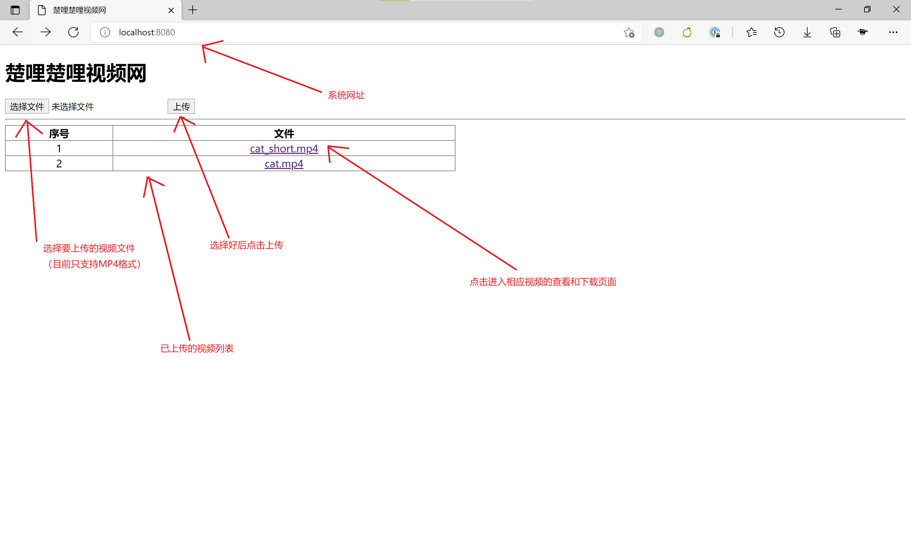
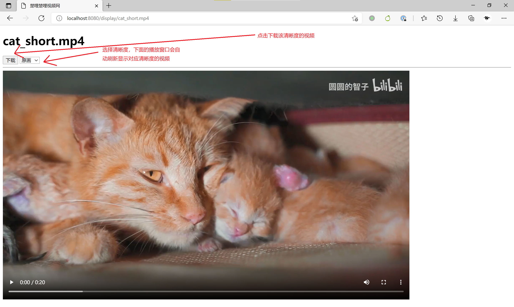

# 楚哩楚哩视频网

本项目是南京大学2021年春季学期《软件体系结构》的课程作业。本项目实现了一个可供用户上传视频、自动把视频转码为360和720两种分辨率、并下载不同分辨率视频的网站。其中，转码模块具有背压机制——即，使用消息队列缓冲待编码任务，如果当前进行中的任务数小于最大任务数，则从消息队列中取出转码任务并执行。我们还使用Vue.js实现了一个简易的前端，作为用户界面，该前端不仅能查看、选择和下载视频，还能直接在浏览器中播放视频。项目的各个模块均可进行水平扩展以提高系统响应性——我们进行的压力测试证明了这一点。

该网站目前仅支持MP4格式的视频。

## 项目依赖

### 应用

- MySQL 8.0.25 on Docker
  - 用户名设置为root，密码设置为theansweris42，将端口3306映射到3306
- MinIO RELEASE.2021-06-17T00-10-46Z on Docker
  - 用户名设置为root，密码设置为theansweris42，将端口9000映射到9001
- RabbitMQ 3.8.17 on Docker
  - 将端口5672映射到5672、15672映射到15672
- HA-Proxy 2.4.0 on Docker
  - 将端口8080映射到8080

### 平台

- 项目的演示在64位Windows 10上进行，使用Docker 20.10.7
- 压力测试在64位Ubuntu 20.04上进行，使用Docker  20.10.7
- 使用本系统需要支持HTML 5和Vue.js的浏览器

## 项目结构

本项目分成两个子模块，模块`browser`供用户上传、浏览和下载视频。

## `browser`模块

要上传视频，我们发送一条HTTP PUT请求到/video，并把视频文件附送在请求体中，`browser`会将收到的视频存放在MinIO文件系统，随后向RabbitMQ发送一条如下形式的消息到RabbitMQ的消息队列videos中

```
{srcFileName}{360pFileName}{720pFileName}
```

这条消息将通知转码模块`encoder`把原始视频转码为360和720分辨率。

注意到，根据HTTP请求的语义，PUT请求应当是幂等的——也就是说重复发送相同的请求仅相当于发送一条请求。也就是说，对于重复请求，我们可以简单地省略掉重复存放视频文件的过程，以加快响应。为了判断两次请求是否重复，我们使用视频文件的文件名判断，我们认为文件名相同则两条请求重复。这种判断方法较为原始，可能导致内容不同的重名文件被判断为重复。在实际应用中，我们可以改用文件的信息摘要（如MD5值）来判断请求是否重复，从而避免这一问题。

要下载视频，我们发送一条HTTP GET请求到/video/{filename}，其中{fileName}代表要下载文件的文件名。

`browser`模块还使用Vue.js实现了一个简易的前端。这一前端可供用户上传视频、查看已上传视频列表、播放已上传视频（可选择3种分辨率，即原始分辨率、360p和720p）、下载已上传视频（同样可选择3种分辨率）。

### `encoder`模块

`encoder`模块从RabbitMQ的消息队列videos中接受消息，并调用JAVE 2库（基于ffmpeg）将消息队列中给出的原始视频转码为360和720两种分辨率，分别存储在指定的文件中。

`encoder`具有背压机制，它会将当前进行中的任务数与提前设定好的最大任务数（我们设置为2）比较，仅当前者小于后者时才从消息队列中取出转码任务、并创建一个新的线程来执行，否则，让消息队列中的任务等待。

## 构建与运行

编译和运行中使用到的Jib插件的网址在中国大陆被屏蔽，如果您在这一地区，请使用代理软件，并将`gradle.properties`中的Proxy设置为合适的值。

### 不使用Docker

要直接运行本项目，请使用如下两条命令

```powershell
./gradlew :browser:bootRun
./gradlew :encoder:bootRun
```

分别构建并启动`browser`和`encoder`，随后使用浏览器访问[http://localhost:8080](http://localhost:8080)使用系统。

### 使用Docker

要将项目打包为Docker镜像，请使用

```bash
git checkout docker
```

将仓库切换到`docker`分支，启动Docker Engine随后运行如下命令

```bash
./gradlew :browser:jibDockerBuild
./gradlew :encoder:jibDockerBuild
```

这两条命令将会把`browser`和`encoder`镜像推送到Docker本地。然而，由于缺失文件`chmod`，`encoder`镜像无法直接运行，因此我们还需对其进行额外的patch，运行

```bash
docker build -t encoder-fix misc/encoder-fix
```

这会推送一个添加了`chmod`的修复版`encoder`镜像`encoder-fix`到Docker中。

随后，我们使用命令

```bash
docker run --name browser -p 8080:8080  -d browser
docker run --name encoder  -d encoder-fix
```

分别运行`browser`和`encoder`。

## 演示

我们使用两个视频文件`cat.mp4`和`cat_short.mp4`进行了演示，其中后者是前者前20秒的剪辑，这两个视频文件可在[此处](https://pan.baidu.com/s/1Wsl9Gvz9RG_EF5r3iGANeA)下载，提取码为e3d5。

演示视频位于`demo/demo.mp4`中。

为了不方便看视频的读者，我们还准备了一个简单的图片介绍，如下：





## 可扩展性与压力测试

### `browser`模块

`browser`模块可使用HA-Proxy进行水平扩展，我们使用Gatling分别测试了使用1台服务器和4台服务器时上传和下载服务的响应时间。上传服务的测试脚本位于`misc/gatling/scripts/UploadSimulation.scala`中，它以每秒4次的速率向`browser`发送PUT请求、持续10秒；下载服务的测试脚本位于`misc/gatling/scripts/DownloadSimulation.scala`中，它以每秒4次的速率向`browser`发送GET请求、持续10秒。

我们使用Docker容器来模拟服务器，每个Docker容器分配0.5个CPU核心（宿主机总共有6个CPU核心）。

使用1台和4台服务器的上传和下载服务平均响应时间如下表：

| 上传/下载 | 服务器数量 | 平均响应时间（ms） |
| --------- | ---------- | ------------------ |
| 上传      | 1          | 91557              |
| 上传      | 4          | 28828              |
| 下载      | 1          | 52182              |
| 下载      | 4          | 10846              |

使用4台服务器与使用1台服务器相比，上传响应时间缩短到原来的31.49%，下载响应时间缩短到原来的20.09%，可见系统的`browser`模块具有可扩展性。

`browser`模块压力测试的原始数据在`misc/gatling/results`中。

### `encoder`模块

为了衡量`encoder`模块的可扩展性，我们使用“任务处理时间”这一指标——即一个视频转码任务从消息被创建到两种分辨率均转码完成的时间。

我们为`browser`添加一个测试用接口，该接口接受一个GET请求，路径为/encoder_test，参数为`fileName`和`times`，接收到该请求后，它以1秒为间隔连续向RabbitMQ的消息队列发送`times`条消息，每条消息都要求`encoder`对文件名为`fileName`的视频文件进行转码，每条消息都将被打上时间戳。这一接口可通过将`MainController.encoderTesting`置为`false`关闭。

我们为`encoder`添加一个测试用功能，当`EncoderApplication/encoderTesting`置为`true`时，它将在每次转码完成后，输出消息被创建的时间戳、转码完成的时间戳和二者之差到文件中。

随后，我们使用Gatling脚本（位于`misc/gatling/scripts/EncoderTest.scala`中）发送一条这样的请求，将参数`fileName`和`times`分别设置为cat_short.mp4（该文件可在[前面](#演示)给出的链接中下载）和8。

我们使用Docker容器来模拟服务器，每个Docker容器分配3个CPU核心（宿主机共有6个CPU核心）。

最终，我们获得使用1台和2台服务器时这8个任务的平均任务处理时间如下：

| 服务器数量 | 平均任务处理时间（ms） |
| ---------- | ---------------------- |
| 1          | 92627                  |
| 2          | 21848.75               |

可以看到，使用2台服务器与使用1台服务器相比，平均任务处理时间下降到原来的23.59%,可见`encoder`模块具有可伸缩性。

`encoder`模块测试的原始数据位于`misc/encoder_results`中。

## 其他

我们使用的HA-Proxy配置位于`misc/haproxy/haproxy.cfg`，配置适用于4台`browser`服务器的情况，要改为适用于1台服务器，只需将后面3条server条目注释掉即可。运行`docker build -t myhaproxy misc/haproxy`来构建以该配置文件为默认配置的HA-Proxy镜像，并将其命名为myhaproxy推送到Docker中。注意，中国大陆访问Docker Hub速度较慢，因此构建时可能需要使用代理软件。
